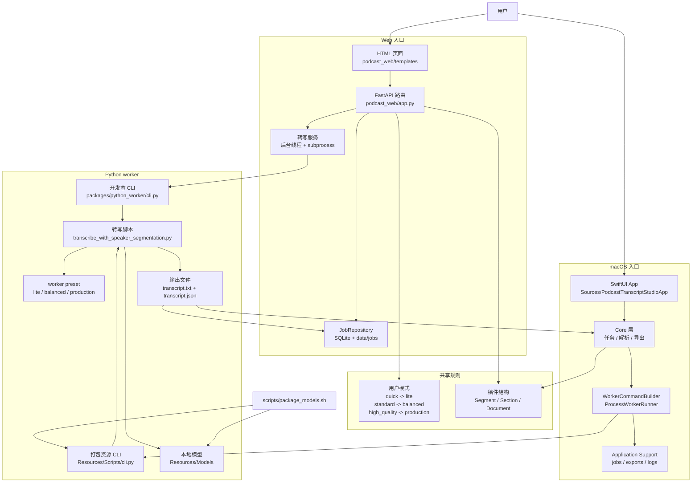

# 开发架构

这份文档说明当前代码结构和开发边界。

## 目标

Podcast Transcript Studio 采用本地优先架构，核心目标是：

- 普通用户可以先通过 Web 入口完成转写
- macOS 入口复用同一套转写能力
- transcript 数据结构、用户模式、worker 执行逻辑保持清晰边界
- 模型推理细节集中在 Python worker 内部

## 技术架构图

当前系统有两个入口：Web app 和 macOS app。两者最终都启动 Python worker，worker 生成 `transcript.txt` 和 `transcript.json`，再由入口层展示、解析或导出。



图里有三个关键边界：

- Web 开发态直接调用 `packages/python_worker/cli.py`。
- macOS 通过 `WorkerCommandBuilder` 调用 `Resources/Scripts/cli.py`，资源由 `scripts/package_models.sh` 从 worker 包和 Hugging Face cache 复制。
- `packages/core/` 和 `packages/transcriber/` 只放共享数据结构与用户模式映射，UI 层不要重复定义底层 preset。

## 分层

### Web 入口

路径：

- `podcast_web/`

职责：

- 上传文件
- 创建任务
- 查看任务状态
- 展示结果
- 提供下载

Web 层不维护独立的 transcript 协议，也不直接管理模型参数。

### transcript 核心

路径：

- `packages/core/transcript.py`

职责：

- `TranscriptSegment`
- `TranscriptSection`
- `TranscriptDocument`
- 可读稿生成逻辑

Web、macOS 和未来 CLI 都应复用这套结构。

### 用户模式

路径：

- `packages/transcriber/modes.py`

职责：

- 定义 `quick`
- 定义 `standard`
- 定义 `high_quality`
- 把用户可理解的模式映射到 worker preset

UI 层只展示模式，不重复定义底层参数。

### Python worker

路径：

- `packages/python_worker/`

职责：

- worker CLI
- ASR preset 配置
- 文本清理
- 转写脚本

`packages/python_worker/transcribe_with_speaker_segmentation.py` 是当前 Python worker 主脚本。macOS 资源目录中的脚本由 `scripts/package_models.sh` 复制生成。

### macOS 核心

路径：

- `Sources/PodcastTranscriptStudioCore/`

职责：

- 任务模型
- 任务存储
- worker 命令构建
- worker 进程执行
- transcript 解析
- 导出格式
- 打包计划

### macOS 界面

路径：

- `Sources/PodcastTranscriptStudioApp/`

职责：

- SwiftUI app 入口
- 导入文件
- 展示任务列表与任务详情
- 展示设置页

## 数据目录

默认本地运行数据：

- `data/uploads/`
- `data/jobs/`
- `data/podcast_web.sqlite3`

这些文件属于运行产物，不应作为源代码提交。

## 测试入口

Python：

```bash
source .venv/bin/activate
python -m pytest tests -v
```

Swift：

```bash
swift test
```

## 开发顺序

建议优先检查共享层，再检查入口层：

1. `packages/core/`
2. `packages/transcriber/`
3. `packages/python_worker/`
4. `podcast_web/`
5. `Sources/PodcastTranscriptStudioCore/`
6. `Sources/PodcastTranscriptStudioApp/`

这样可以减少重复逻辑，也能让 Web 和 macOS 的行为更一致。
